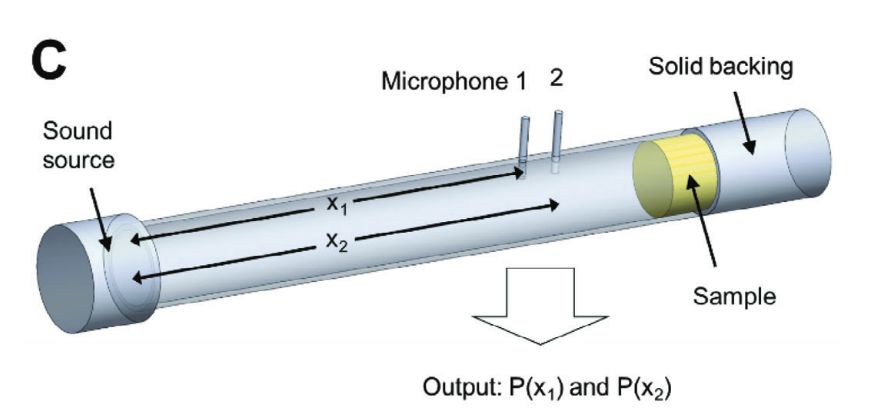
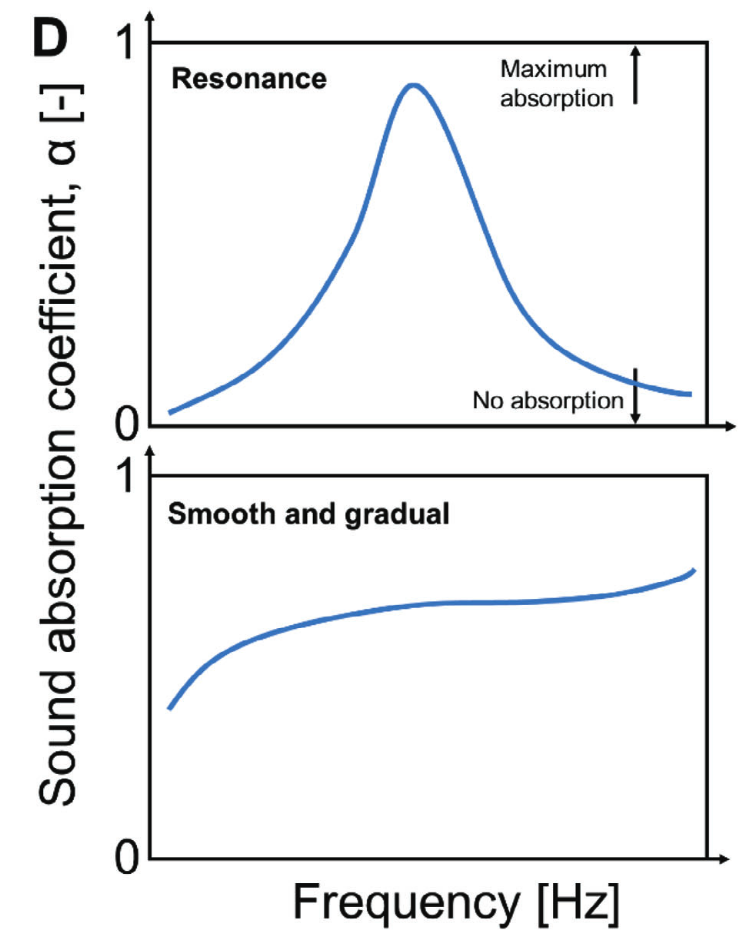
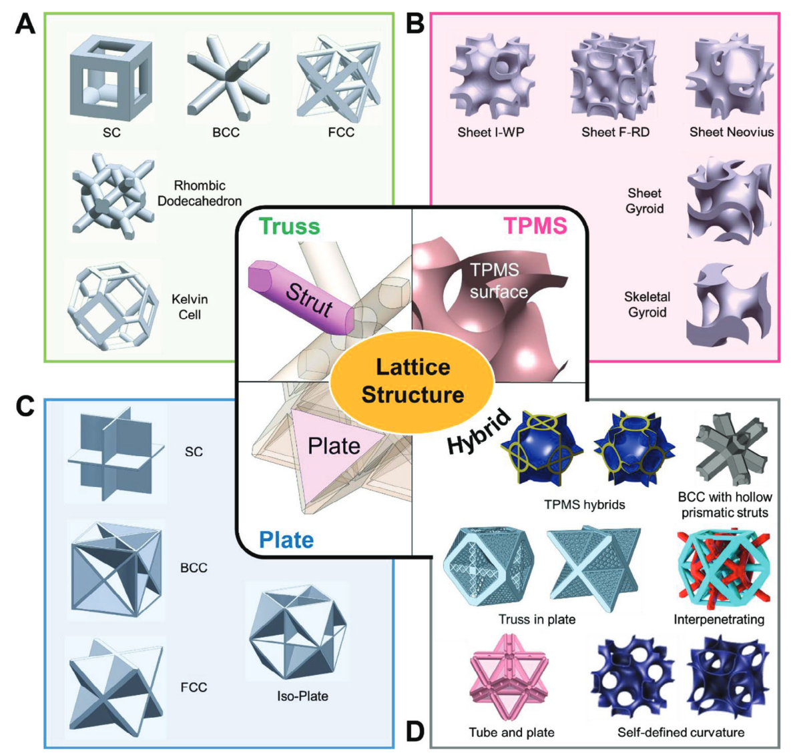
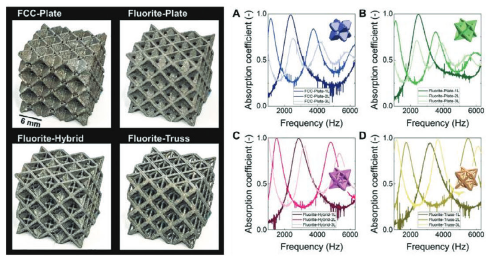
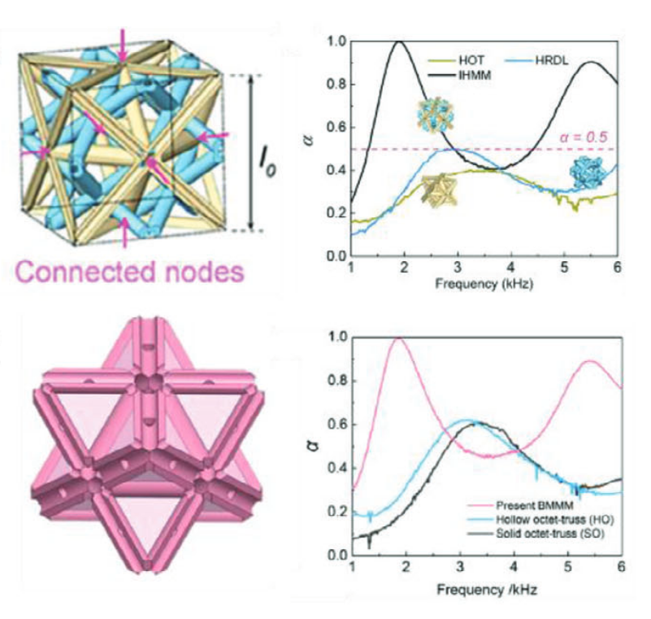
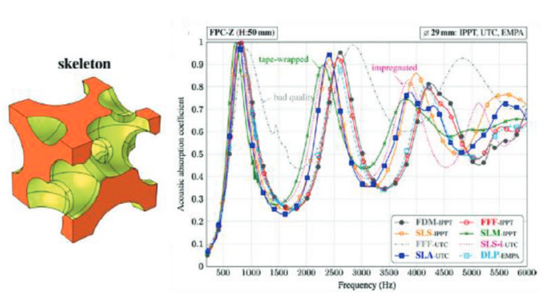
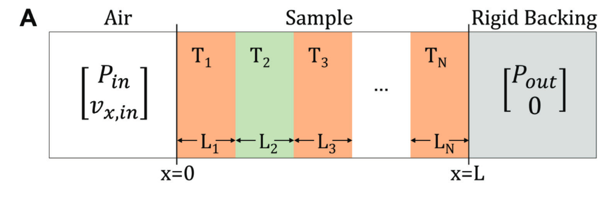

# 3D‐Printed Lattice Structures for Sound Absorption: Current Progress,Mechanisms and Models,Structural‐Property Relationships, and Future Outlook

## Xinwei Li, Wei Zhai
## 2023.11  Advanced Science

---
## What is sound in mathematics?
 The propagation of sound is described by the wave equation in continuous media:
  $$
  \frac{\partial^2 p}{\partial t^2} = c^2(x) \nabla^2 p
  $$
  where:
  - $p(x, t)$ is the pressure distribution of the sound wave.
  - $c(x)$ is the speed of sound in the medium, which is not necessarily continuous.

---
## What is sound absorption?
The conversion of the kinetic energy of the motion of molecules into thermal energy.

- Dissipation at the viscous boundary layer
- Thermal dissipation
- Dissipation contributed by physical vibration of the material/structure

---
## Impedance tube technique

---

$$
P(x) = A e^{-ikx} + B e^{ikx}
$$

The transfer function between points 1 and 2 is calculated as:
$$
H_{12} = \frac{P(x_2)}{P(x_1)}= \frac{A e^{-ikx_2} + B e^{ikx_2}}{A e^{-ikx_1} + B e^{ikx_1}}= \frac{e^{-ikx_2} + R e^{ikx_2}}{e^{-ikx_1} + R e^{ikx_1}}
$$

Finally, the absorption coefficient is then calculated as:
$$
\alpha=1-|R|^2
$$
---
## Sound Absorption Coefficient Curve

The y-axis corresponds to the intensity of absorption, ranging from 0 to 1, with 1 referring to the highest absorption. The x-axis corresponds to the frequency

---
## Acoustic Impedance
The opposition of the system to the acoustic flow
$$ Z=Z_0\left(\frac{1+R}{1-R}\right) $$
$Z_0$ refers to the acoustic impedance of air at standard conditions, given by the multiplication of the speed of sound $c_0$ and density $ρ0$ of air at standard conditions.
$$\alpha = \frac{4 \operatorname{Re}(Z_r)}{[1 + \operatorname{Re}(Z_r)]^2 + [\operatorname{Im}(Z_r)]^2}$$

--- 
## Lattice Structures
### Truss, TPMS, Plate, Hybrid

---

---

---

---
## Fabrication of Lattice Structures
- Vat Photopolymerization 槽型光聚合
- Powder-Bed Fusion 粉末床熔融
- Fused Deposition Modelling 熔融沉积建模

---
## The Transfer Matrix Method

---