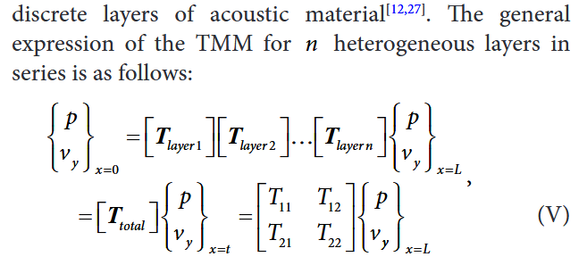
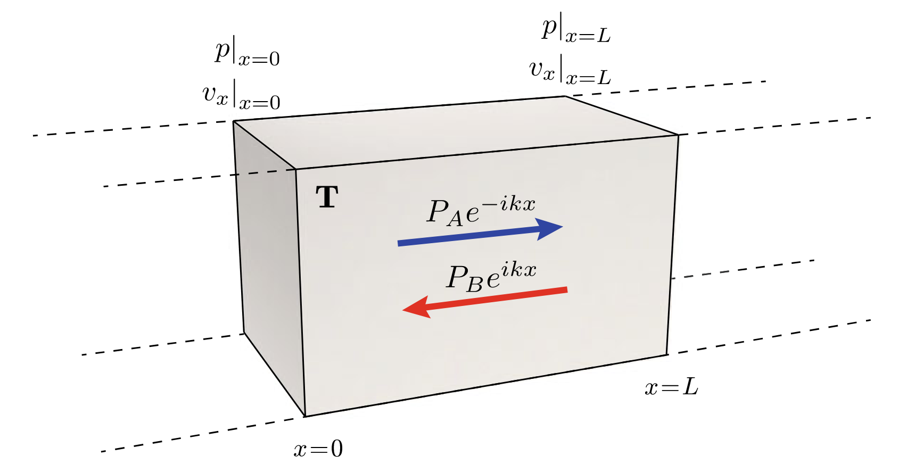
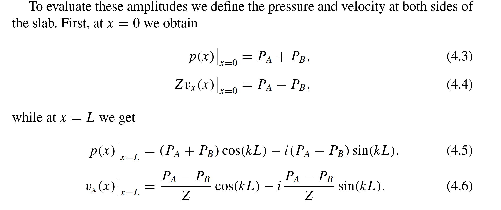
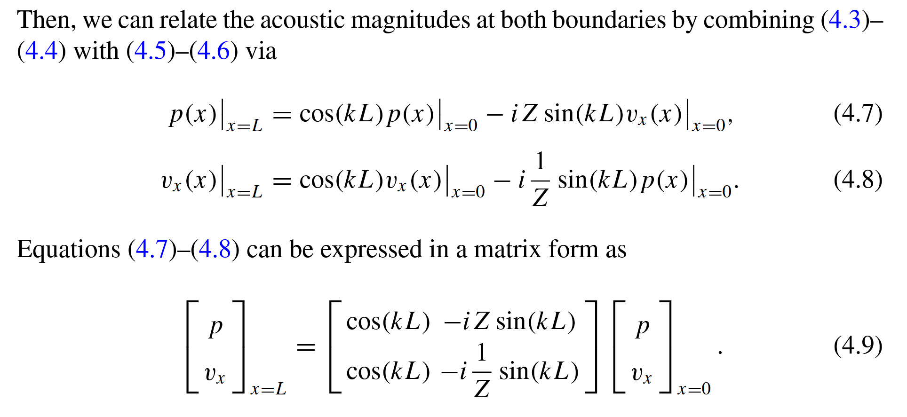
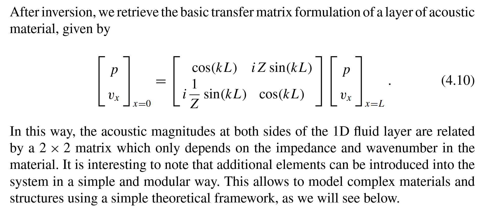
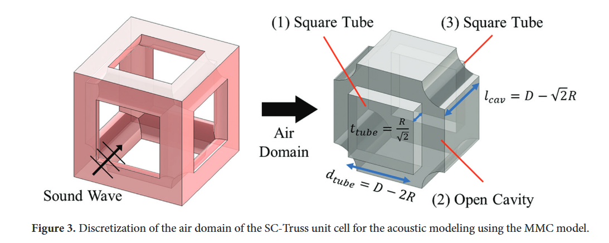
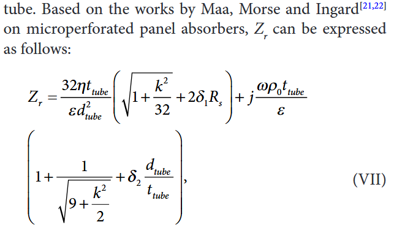
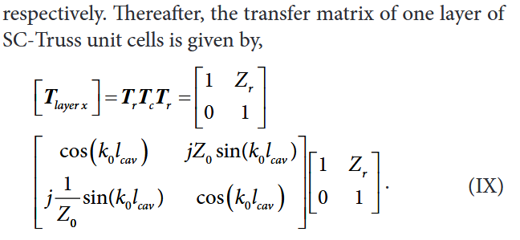

# LattSAC: a software for the acoustic modelling of lattice sound absorbers

**Jun Wei Chua, Zhejie Lai, Xinwei Li & Wei Zhai**

**Received** 17 January 2024 **Accepted** 3 April 2024

Virtual and Physical Prototyping **SCI** Q1 **IF** 10.2

---

---

Deriving the basic relations between the acoustic magnitudes evaluated at the boundaries of a layer of homogeneous acoustic material

---

Assuming that only longitudinal plane waves propagate in the layer and a temporal harmonic dependence of the type eiωt , the total field inside the material is written as the superposition of two waves propagating in opposite directions as

$$ p(x)=P_A\mathrm{e}^{-\mathrm{i}kx}+P_B\mathrm{e}^{\mathrm{i}kx} $$

$$ v_x(x)=\frac{P_A}{Z}\mathrm{e}^{-\mathrm{i}kx}-\frac{P_B}{Z}\mathrm{e}^{\mathrm{i}kx} $$

where Z = ρc is the characteristic acoustic impedance, k = ω/c is the wavenumber at the angular frequency ω = 2π f , with ρ the density and c the sound speed of the material, and the amplitudes of the two waves are given by PA and PB.

---

---

---

---

## Multi-layered micropore-cavity (MMC) model

View the lattices as multiple layers of micropores with air cavities in between.

---

---

---

---