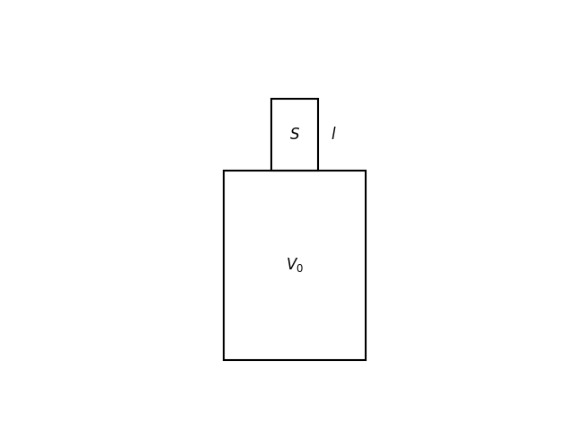
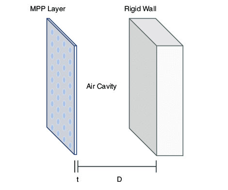
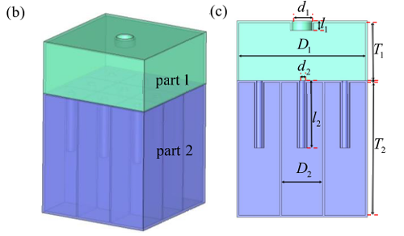

# Helmholtz Resonator

---

- Cavity volume: $V_0$
- Neck length: $l$
- Cross-sectional area: $S$
- Gas pressure: $p_0$
- Speed of sound: $c$

---

According to the ideal gas law:
   $$
   p_0 (V_0 + S \Delta x)^\gamma = p' V_0^\gamma
   $$

After approximation:
   $$
   p' = p_0 \left( 1 + \frac{\gamma S \Delta x}{V_0} \right)
   $$

Restoring force:
   $$
   F = (p' - p_0) S
   $$

Simplified:
   $$
   F = \frac{\gamma S^2 p_0}{V_0} \Delta x
   $$

---
Stiffness:
$$
   k = \frac{\gamma S^2 P_0}{V_0}
$$

Equivalent mass:
   $$
   m = S l \rho
   $$

Resonance frequency:
   $$
   f_h = \frac{1}{2\pi} \sqrt{\frac{S\gamma p_0}{V_0 l\rho}}=\frac{1}{2\pi}\sqrt{\frac{S}{V_0l}}\sqrt{\frac{\gamma p_0}{\rho}}
   $$

---

$$
\sqrt{\frac{\gamma p_0}{\rho}} = \sqrt{\frac{\gamma nkT}{\rho}} =\sqrt{\frac{\gamma nkT}{n m_0}}=\sqrt{\frac{\gamma kT}{m_0}}= \sqrt{\frac{\gamma R T}{\mu}} =c

$$

$$ f_h=\frac{c}{2\pi}\sqrt{\frac{S}{V_0l}} $$

At resonance, the air oscillates most vigorously at the neck of the Helmholtz resonator. A highly concentrated thermal and viscous dissipation thus takes place there.

---
## Microperforated panels (MPP)

---
## Multi-layered Helmholtz resonator (MLHR)

---

pore diameter, d
pore thickness, t
depth of the air-backed cavity, D
surface porosity, σ

---

For a single-layered MPP, its resonant frequency is equivalent to 
$$ f_h=\frac{c}{2\pi}\sqrt{\frac{S}{V_0l}} $$

However, MLHRs are more sought-after for practical applications due to their ability to introduce a greater number of resonant peaks, resulting in a broader absorption bandwidth.

---

Interestingly, many lattice structures take up the morphology of an MLHR. This also implies that these lattice structures can be sufficiently described using the geometrical parameters d, t, D, and σ, for elucidating their sound absorption properties.

---

The overall acoustic impedance of a material can be derived using TMM. 

For MLHRs, there are two distinct sets of transfer matrices and corresponding acoustic impedances one linked to the narrow pore and the other to the large cavity.

---