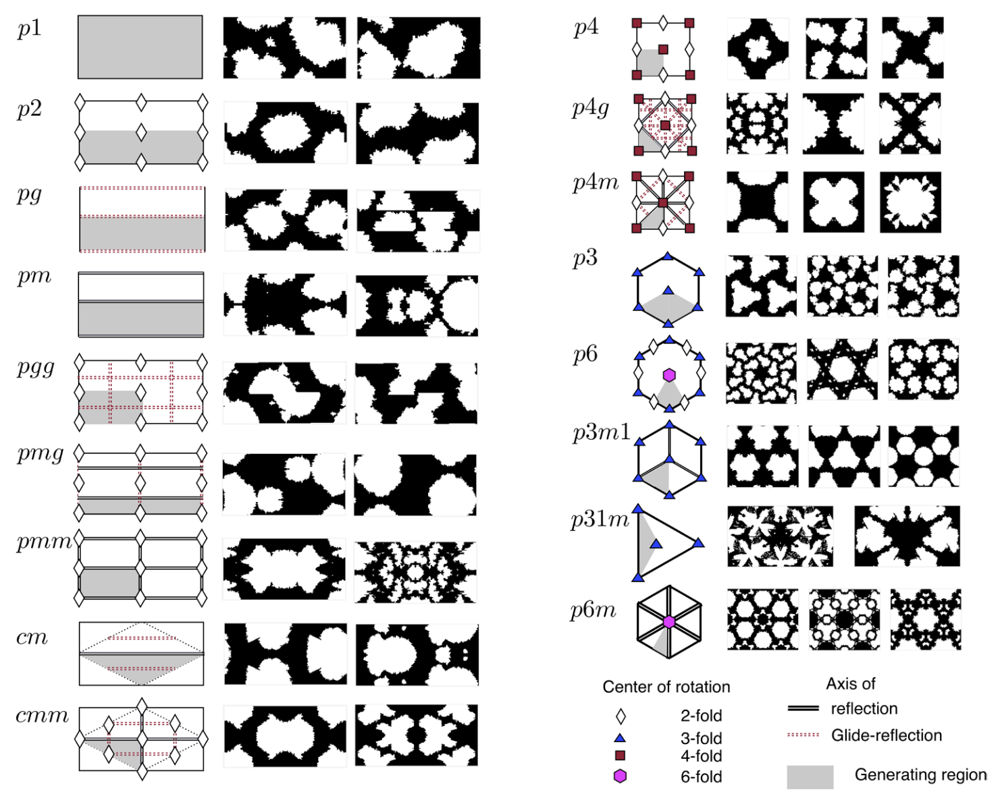

# Designing complex architectured materials  with generative adversarial networks

**Yunwei Mao1, Qi He, Xuanhe Zhao** Massachusetts Institute of Technology

Science Advances **SCI** Q1 **IF** 11.7 

24 April 2020

---
