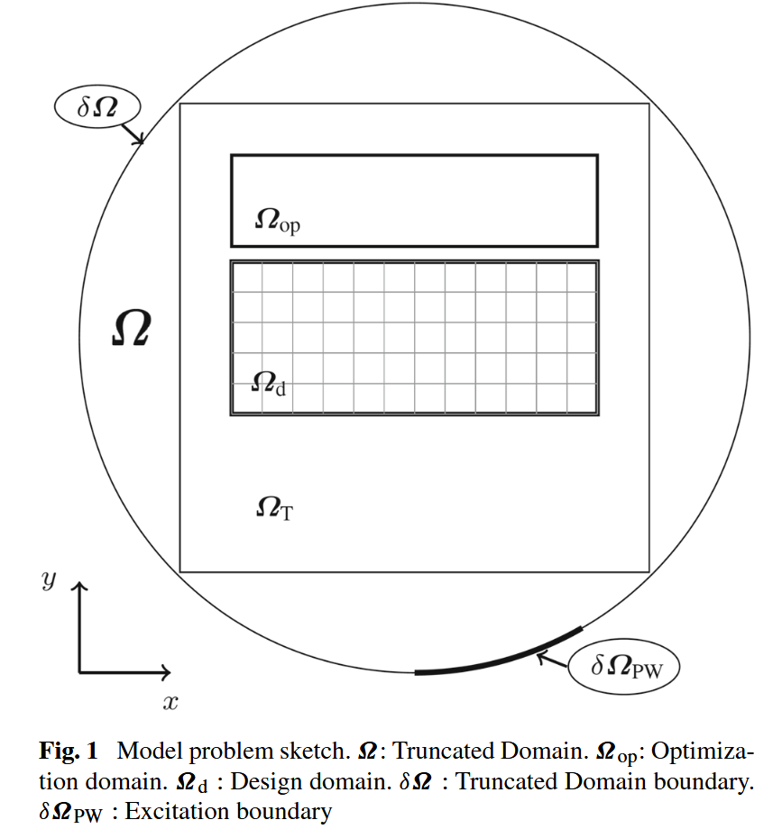
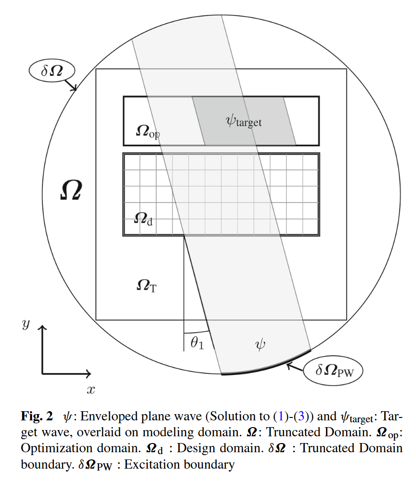
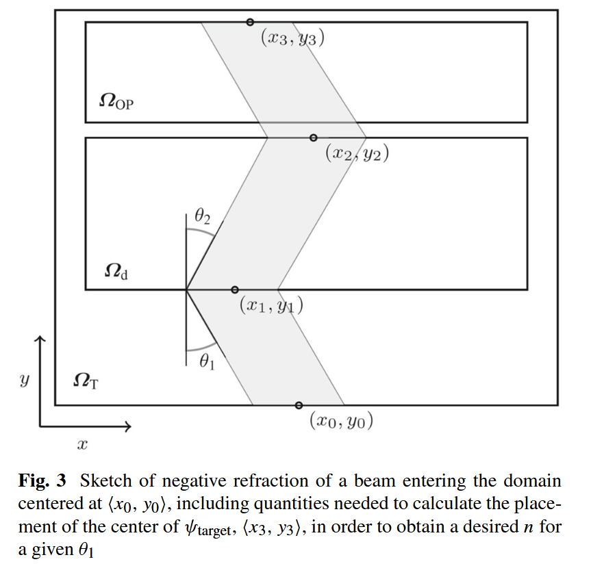
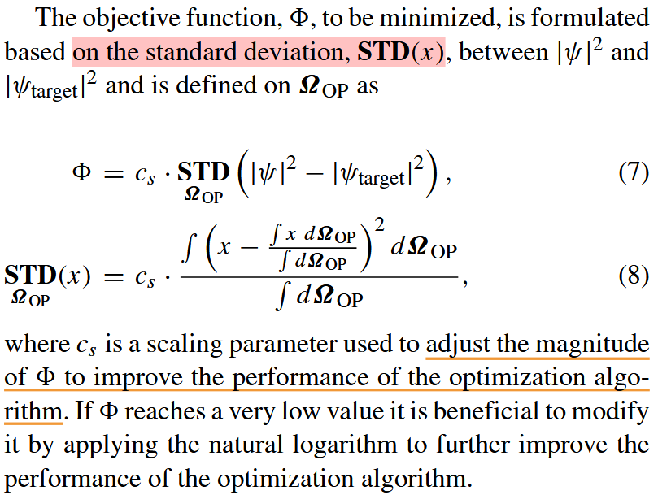

# Designing meta material slabs exhibiting negative refraction using topology optimization

Rasmus E. Christiansen1 · Ole Sigmund1

Structural and Multidisciplinary Optimization

18 March 2016

---

---

---

---
