# Topology optimization design for total sound absorption in porous  media

Joong Seok Lee (忠南大学) · Yoon Young Kim (首尔大学)

Computer Methods in Applied Mechanics and Engineering

Received 19 February 2019; accepted 30 October 2019

---

Macroscopic topology optimization, rather than multi-scale topology optimization.

Learn the numerical calculation methods of sound absorption coefficients.

The energy of sound is divided into three parts: reflected, transmitted, and dissipated.

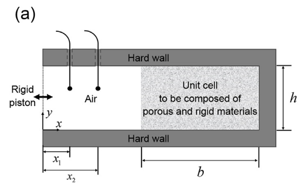

Enclosed by an acoustically "hard wall," with no transmitted portion.

---

$$
P(x) = A e^{-ikx} + B e^{ikx},\quad R=\frac{B}{A},\quad \alpha=1-|R|^2
$$

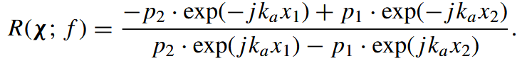

---
To calculate the sound absorption coefficient, it is necessary to solve the equations to determine p1​ and p2​. The equation for sound propagation is
$$
  \frac{\partial^2 p}{\partial t^2} = c^2(x) \nabla^2 p.
  $$

The steady-state acoustic pressure p of an acoustic domain is governed by 
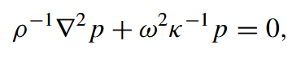
where the symbols ρ and κ denote the density and bulk modulus of the acoustic medium filled in the domain, respectively.

---
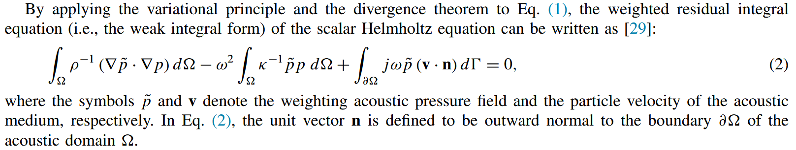
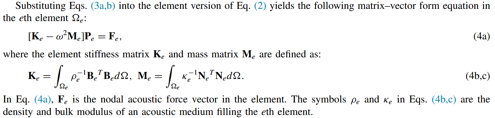

---
Two target materials in unit cells: a porous material and a rigid material
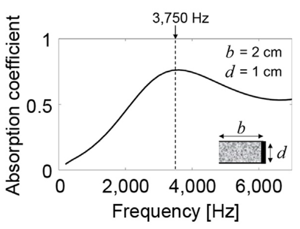

---
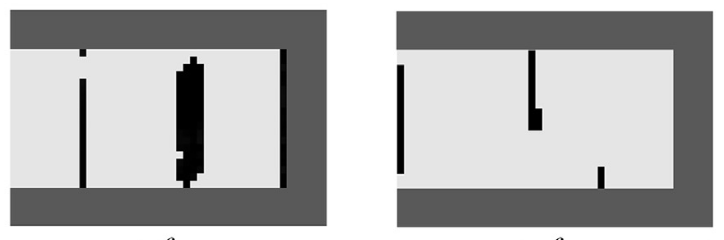
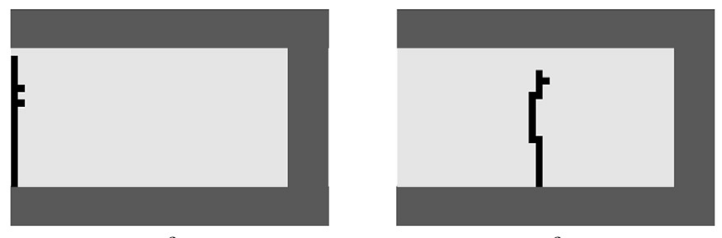

---
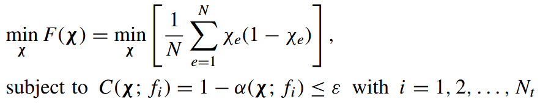
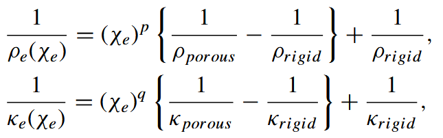

---
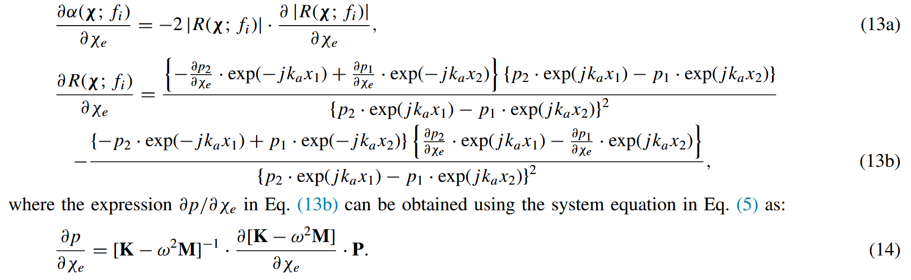

---

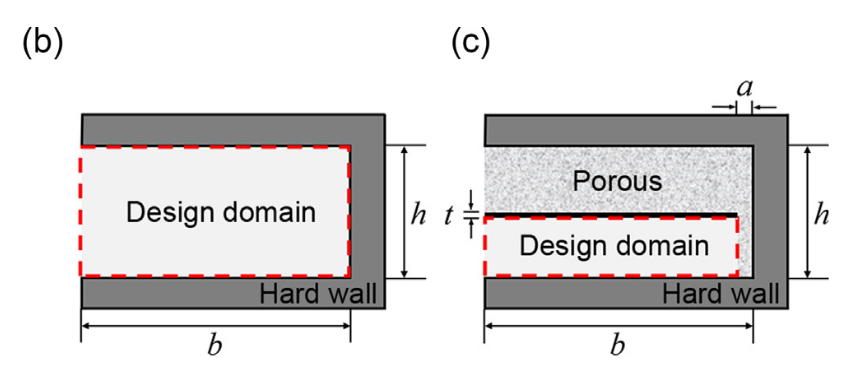

---
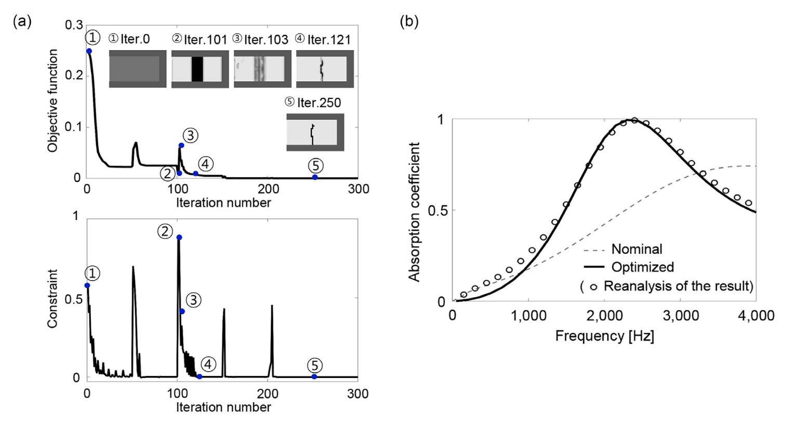

---
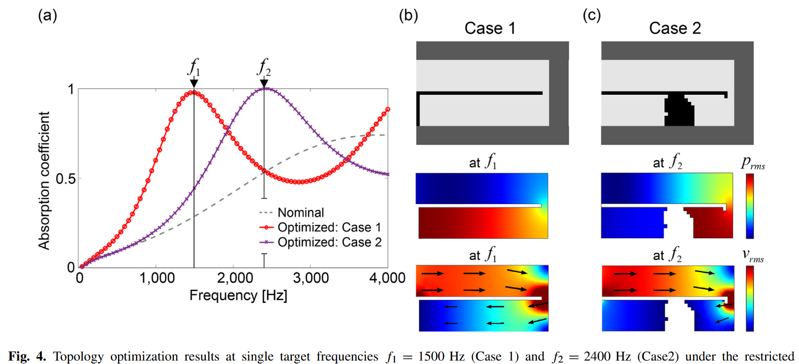
quarter-wavelength resonance

---

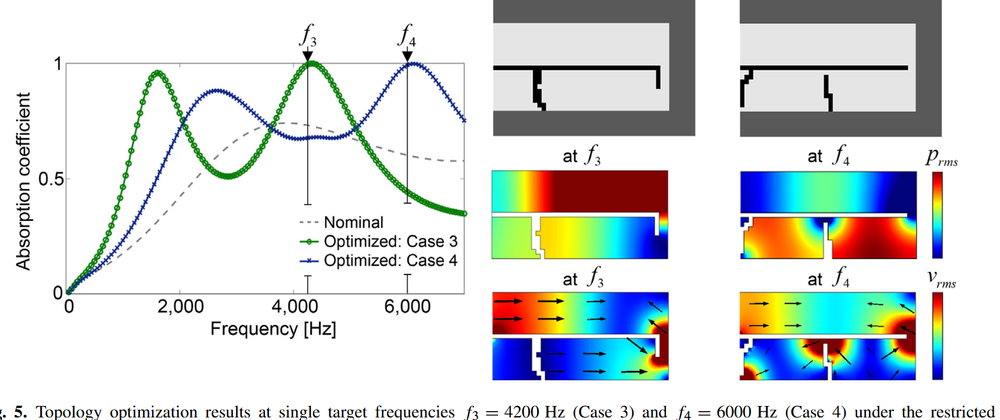

a three-quarter-wavelength resonance forms to achieve the sound absorption coefficient nearly equal to 1 at f = f3, while the quarter-wavelength resonance makes the first absorption peak at the frequency lower than 2000 Hz.

---

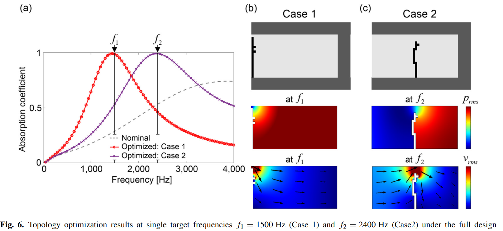

Helmholtz resonance

---
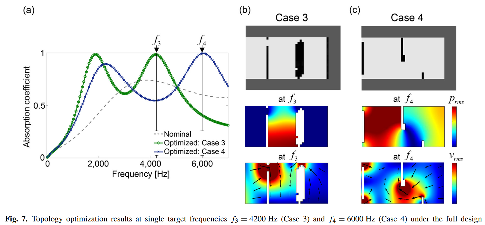

---
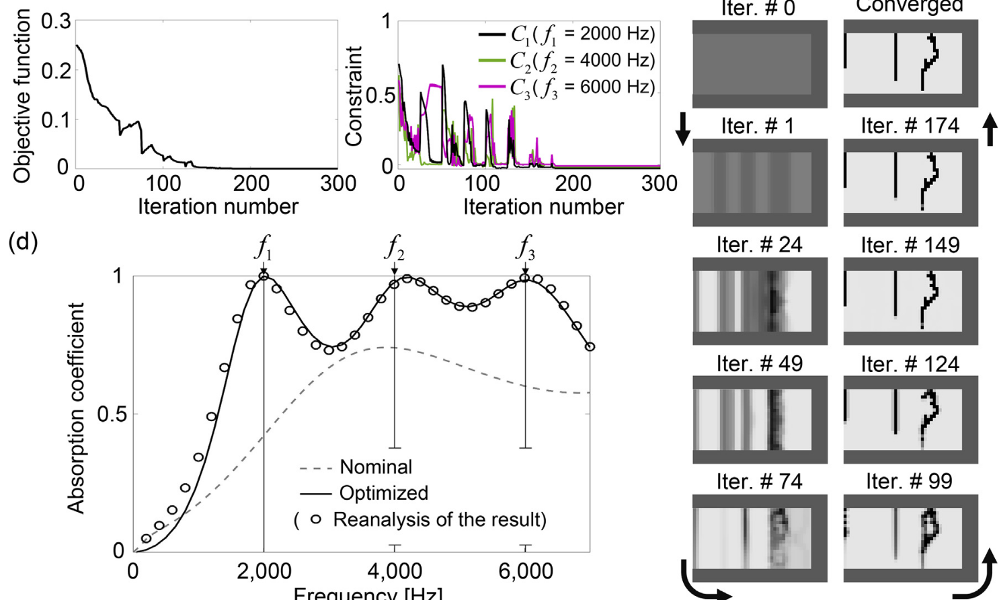

---
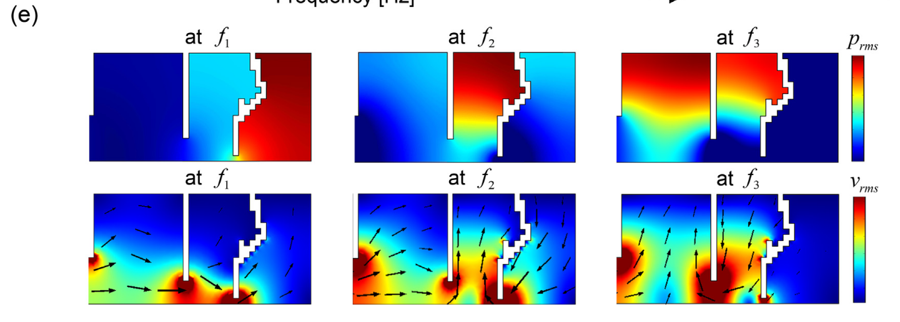

---
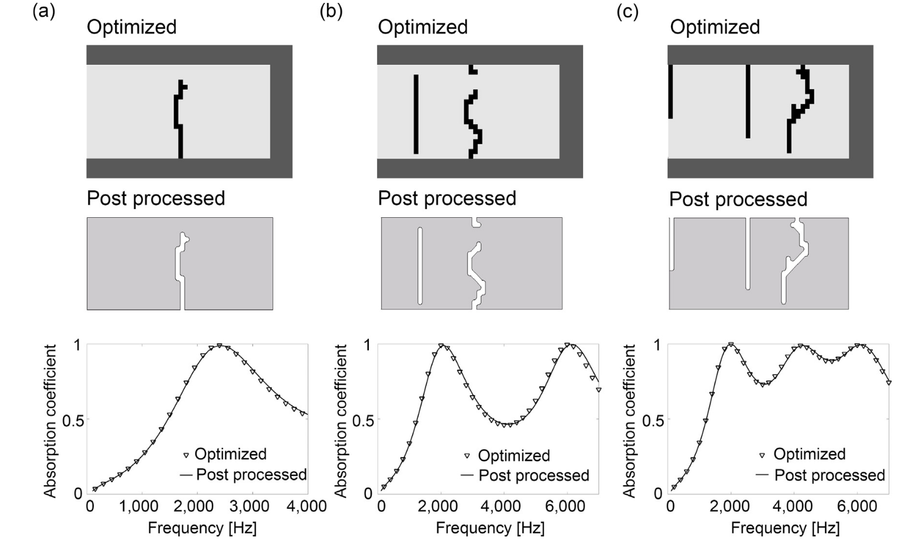