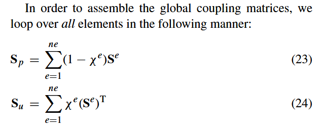
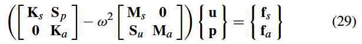
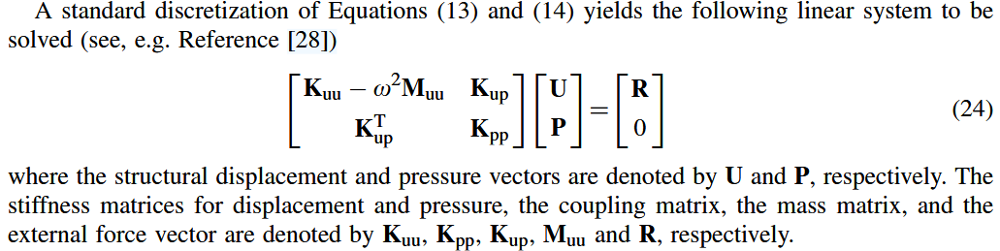
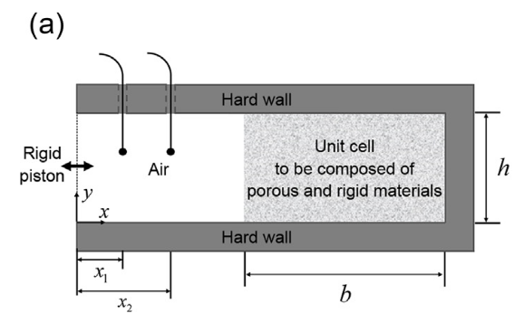
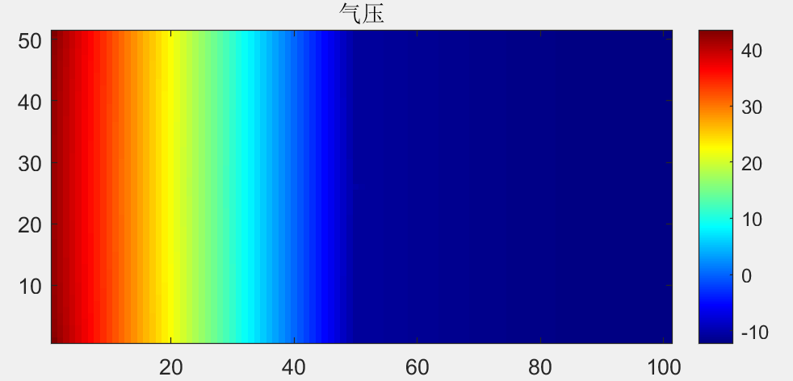

# Topology Optimization for Vibro-Acoustics
---
## Acoustic Wave
（以下论证不完全严谨）声压的波动方程
$$ \frac{1}{c_0^2}\frac{\partial^2 p}{\partial t^2}=\nabla^2 p $$
根据维基百科,声速平方是体积模量跟密度之比
$$ \frac{1}{\kappa}\frac{\partial^2 p}{\partial t^2}=\frac{1}{\rho} \nabla^2 p $$
假设声压 $p(x,t)$ 是时谐的,即实际上是 $p(x)\mathrm{e}^{\mathrm{i}\omega t}$,得到空间部分满足Helmholtz方程
$$ \frac{1}{\rho} \nabla^2 p+\frac{\omega^2}{\kappa}p=0 $$
---
空间部分真正满足的Helmholtz方程是
$$\nabla\cdot(\rho^{-1}\nabla p)+\omega^2\kappa^{-1}p=0,\quad x\in \Omega$$
设 $\tilde{p}$ 是测试函数,在方程两端同乘 $\tilde{p}$ 并在 $\Omega$ 上积分得到
$$\int_\Omega\tilde{p}\nabla\cdot(\rho^{-1}\nabla p)+\int_{\Omega}\rho^{-1}\nabla\tilde{p}\cdot\nabla p=\int_{\Omega}\nabla \cdot (\tilde{p}\rho^{-1}\nabla p)=\int_{\partial\Omega}\tilde{p}\rho^{-1}\nabla p\cdot\vec{n}$$
$$\int_{\Omega}\rho^{-1}\nabla\tilde{p}\cdot\nabla p-\int_\Omega\omega^2\kappa^{-1}p\tilde{p}-\int_{\partial\Omega}\tilde{p}\rho^{-1}\nabla p\cdot\vec{n}=0$$
---
考虑四边形单元,
$$p=p_1N_1+p_2N_2+p_3N_3+p_4N_4=\begin{pmatrix}
N_1&N_2&N_3&N_4
\end{pmatrix}\begin{pmatrix}
p_1\\p_2\\p_3\\p_4
\end{pmatrix}$$
其中
$$N_1(x,y)=\frac{1}{4}(1+2x)(1+2y),N_2=\frac{1}{4}(1-2x)(1+2y),N_3=\frac{1}{4}(1-2x)(1-2y),N_4=\frac{1}{4}(1+2x)(1-2y)$$
---
那么梯度 $\nabla p$ 可以计算如下（可类比根据位移计算应变,但梯度的关系更加直接简单）
$$\nabla p=\begin{pmatrix}\partial_x\\\partial_y\end{pmatrix}p=\begin{pmatrix}\partial_x\\\partial_y\end{pmatrix}\begin{pmatrix}
N_1&N_2&N_3&N_4
\end{pmatrix}\begin{pmatrix}
p_1\\p_2\\p_3\\p_4
\end{pmatrix}=\frac{1}{2}\begin{pmatrix}
1+2y&-1-2y&-1+2y&1-2y\\
1+2x&1-2x&-1+2x&-1-2x
\end{pmatrix}\begin{pmatrix}
p_1\\p_2\\p_3\\p_4
\end{pmatrix}$$
这样一来在一个单元 $[-0.5,0.5]\times[-0.5,0.5]$ 上 $\int_{\Omega}\nabla\tilde{p}\cdot\nabla p$ 可以计算如下
$$\frac{1}{4}\int_{[-0.5,0.5]}\int_{[-0.5,0.5]}\begin{pmatrix}
\tilde{p}_1&\tilde{p}_2&\tilde{p}_3&\tilde{p}_4
\end{pmatrix}\begin{pmatrix}
1+2y&1+2x\\
-1-2y&1-2x\\
-1+2y&-1+2x\\
1-2y&-1-2x
\end{pmatrix}\begin{pmatrix}
1+2y&-1-2y&-1+2y&1-2y\\
1+2x&1-2x&-1+2x&-1-2x
\end{pmatrix}\begin{pmatrix}
p_1\\p_2\\p_3\\p_4
\end{pmatrix}$$
---
完成积分的计算,最终得到的结果是
$$\frac{1}{6}\begin{pmatrix}
\tilde{p}_1&\tilde{p}_2&\tilde{p}_3&\tilde{p}_4
\end{pmatrix}\begin{pmatrix}
4&-1&-2&-1\\
-1&4&-1&-2\\
-2&-1&4&-1\\
-1&-2&-1&4
\end{pmatrix}\begin{pmatrix}
p_1\\p_2\\p_3\\p_4
\end{pmatrix}$$
同样的在一个单元上 $\int_{\Omega}\tilde{p}p$ 可以类似计算
$$\frac{1}{36}\begin{pmatrix}
\tilde{p}_1&\tilde{p}_2&\tilde{p}_3&\tilde{p}_4
\end{pmatrix}\begin{pmatrix}
4&2&1&2\\
2&4&2&1\\
1&2&4&2\\
2&1&2&4
\end{pmatrix}\begin{pmatrix}
p_1\\p_2\\p_3\\p_4
\end{pmatrix}$$
---
接下来我们讨论声压 $p$ 应该满足的边界条件,以处理 $\int_{\partial\Omega}\tilde{p}\rho^{-1}\nabla p\cdot\vec{n}$ 这一项.

- Pressure boundary condition: $p = p_0$
- Hard wall condition: $\mathbf{n} \cdot \nabla p = 0$
- Acceleration boundary condition: $\mathbf{n} \cdot \nabla p = a_n$

---
## Elastic waves
弹性体的运动方程
$$ \nabla\cdot \sigma + \vec{f} = \rho_s \frac{\partial^2\vec{u}}{\partial t^2} $$
假设无体力 $\vec{f}$,且 $\vec{u}$ 是时谐的,则得到振动方程
$$ \nabla\cdot \sigma = -\omega^2\rho_s \vec{u} $$
其有限元编程不再赘述

---
## Vibro-Acoustics
声振耦合是说,定义域 $\Omega$ 分为 $\Omega_a$ 和 $\Omega_s$ 两部分, $\Omega_a$ 由空气占据, $\Omega_s$ 由固体占据.

单独看 $\Omega_a$,这是一个纯声波问题,需要求解的是处处的声压 $p$.

单独看 $\Omega_s$,这是一个纯弹性波问题,需要求解的是处处的位移 $\vec{u}$.

声振耦合是多物理场耦合的问题,特别是两个物理场服从的方程并不相同.

二者发生耦合的位置在交界面处,互相成为边界条件.

---
研究 $\Omega_a$,那么弹性体的振动激发声波,准确来说
$$\vec{n}\cdot \nabla p=\omega^2\rho_a\vec{n}\cdot \vec{u}$$
应该将这个式子理解为牛顿第二定律,给整个式子同乘上时间因子 $\mathrm{e}^{\mathrm{i}\omega t}$,则
$$\vec{n}\cdot \nabla (p\mathrm{e}^{\mathrm{i}\omega t})=-\vec{n}\cdot \rho_a \frac{\mathrm{d} v}{\mathrm{d} t}=\omega^2\rho_a\vec{n}\cdot \vec{u}\mathrm{e}^{\mathrm{i}\omega t}=-\rho_a\vec{n}\cdot \frac{\mathrm{d}^2 \vec{u}\mathrm{e}^{\mathrm{i}\omega t}}{\mathrm{d} t^2}$$
从而可以看到这个式子是说边界处空气微元与弹性体微元有相同的加速度.

---
从有限元编程的角度来看,这个边界条件属于前面提过的Acceleration边界条件.

考虑 $\Omega_a$中交界处的一个单元
$$\int_{\partial\Omega}\tilde{p}\rho_a^{-1}\nabla p\cdot\vec{n}\mathrm{d}\Gamma=\int_{\partial\Omega}\tilde{p}\omega^2\vec{n}\cdot \vec{u}\mathrm{d}\Gamma=\omega^2\int_{\partial\Omega}N_a\tilde{\mathbf{p}}\vec{n}^TN_s\mathbf{u}\mathrm{d}\Gamma=\omega^2\tilde{\mathbf{p}}^T\int_{\partial\Omega}N_a^T\vec{n}^TN_s\mathrm{d}\Gamma\mathbf{u}$$
这里我默认 $N_a,N_s$ 是行向量,而 $\tilde{\mathbf{p}},\mathbf{u},\vec{n}$ 是列向量.记
$$S_e=\int_{\partial\Omega}N_a^T\vec{n}^TN_s,\quad S=\sum S_e,\quad \mathbf{f}^{u}_a=\omega^2S\mathbf{u}.$$

---
接下来研究 $\Omega_s$,那么声压成为弹性体的面压力,准确来说,
$$\vec{g}=p\vec{n}$$
这是Neumann边界条件.考虑 $\Omega_s$ 中交界处的一个单元,
$$\int_{\partial\Omega}\vec{g}\tilde{\vec{u}}\mathrm{d}\Gamma=\int_{\partial\Omega}p\vec{n}\tilde{\vec{u}}\mathrm{d}\Gamma=\mathbf{p}^T\int_{\partial\Omega}N_a^T\vec{n}^TN_s\mathrm{d}\Gamma\tilde{\mathbf{u}}=\mathbf{p}^TS_e\tilde{\mathbf{u}}=\tilde{\mathbf{u}}^TS_e^T\mathbf{p}$$
记 $\mathbf{f}^{p}_s=S^T\mathbf{p}$,于是我们有以下线性方程组
$$(K_s-\omega^2M_s)\mathbf{u}=\mathbf{f}_s+\mathbf{f}^{p}_s=\mathbf{f}_s+S^T\mathbf{p}$$
$$(K_a-\omega^2M_a)\mathbf{p}=\mathbf{f}_a+\mathbf{f}^{u}_a=\mathbf{f}_a+\omega^2S\mathbf{u}$$
或者可以写成
$$\left(\begin{bmatrix}
K_s&-S^T\\
0&K_a
\end{bmatrix}-\omega^2\begin{bmatrix}
M_s&0\\
S&M_a
\end{bmatrix}\right)\begin{pmatrix}
\mathbf{u}\\
\mathbf{p}
\end{pmatrix}=\begin{pmatrix}
\mathbf{f}_s\\
\mathbf{f}_a
\end{pmatrix}.$$

---
以上求解方式,显然需要我们明确知道 $\Omega_a$ 与 $\Omega_s$ 的几何边界,因此并不适用于使用连续值作为设计变量的拓扑优化.

文献中提出了许多解决方式,下面介绍两种

---
## 使用连续变量计算边界的有限元编程项
- A simple method for coupled acoustic-mechanical analysis with application to gradient-based topology optimization
- 作者：Jakob S. Jensen 期刊：SMO 日期：15 November 2018

---
## 使用一个方程统一声波和弹性波方程
- Topology optimization of acoustic–structure interaction problems using a mixed finite element formulation
- 作者：Gil Ho Yoon, Jakob Søndergaard Jensen and Ole Sigmund
- 期刊：IJNME 日期：31 October 2006

---
回忆流体是静止时应力张量没有剪切分量的弹性体,也就是流体静止时的应力张量是标量矩阵.为了让弹性波满足的方程可以在应力张量是标量矩阵时退化为声波方程,我们将 $\sigma$ 和 $\epsilon$ 进行分解
$$\sigma=\frac{\operatorname{tr}\sigma}{3}I+\left(\sigma-\frac{\operatorname{tr}\sigma}{3}I\right)=\sigma_{\text{球}}+\sigma_{\text{斜}},\quad \epsilon=\frac{\operatorname{tr}\epsilon}{3}I+\left(\epsilon-\frac{\operatorname{tr}\epsilon}{3}I\right)=\epsilon_{\text{球}}+\epsilon_{\text{斜}}$$

---
回忆使用拉梅系数 $\lambda,\mu$ 表达的应力应变关系是 $\sigma=2\mu\epsilon+\lambda\operatorname{tr}\epsilon I$ ,改成用体积模量 $K$ 和剪切模量 $\mu$,
$$\sigma=K\operatorname{tr}\epsilon I+2\mu\left(\epsilon-\frac{\operatorname{tr}\epsilon}{3}I\right)$$
比较得到
$$\frac{\operatorname{tr}\sigma}{3}=K\operatorname{tr}\epsilon,\quad \sigma-\frac{\operatorname{tr}\sigma}{3}I=2\mu\left(\epsilon-\frac{\operatorname{tr}\epsilon}{3}I\right)$$

---
将 $\sigma$ 和 $\epsilon$ 写成列向量得到 $\sigma=C\epsilon$,相应的分量之间也满足 $\sigma_{\text{球}}=C\epsilon_{\text{球}},\sigma_{\text{斜}}=C\epsilon_{\text{斜}}$.回忆弹性波满足
$$-\nabla\cdot \sigma=\omega^2\rho_s \vec{u}$$
其弱形式的推导完全类似之前,
$$-\int_{\Omega}\sigma_{ij,j}v_i\mathrm{d} x=\int_{\Omega}\sigma_{ij}v_{i,j}\mathrm{d} x-\int_{\Gamma}\sigma_{ij}v_in_j\mathrm{d} S=\int_{\Omega}\sigma_{ij}\epsilon_{ij}(v)\mathrm{d} x-\int_{\Gamma}\sigma_{ij}v_in_j\mathrm{d} S$$
$$\int_{\Omega}\sigma_{ij}\epsilon_{ij}(v)\mathrm{d} x=\int_{\Omega}\epsilon(v)C\epsilon(u)\mathrm{d} x=\int_{\Omega}\epsilon(v)_{\text{球}}C\epsilon(u)_{\text{球}}+\epsilon(v)_{\text{斜}}C\epsilon(u)_{\text{斜}}\mathrm{d} x$$

---
考虑到流体情形中 $\sigma_{\text{斜}}=0$ 而 $\sigma=\sigma_{\text{球}}=-pI$,所以令 $\sigma_{\text{球}}=K\operatorname{tr}\epsilon=-pI$ ,积分方程变为
$$\int_{\Omega}-p\epsilon(v)_{\text{球}}+\epsilon(v)_{\text{斜}}C\epsilon(u)_{\text{斜}}\mathrm{d} x-\int_{\Gamma}\sigma_{ij}v_in_j\mathrm{d} S=\omega^2\int_{\Omega}\rho u_iv_i\mathrm{d} x$$
将 $p$ 视为额外的变量,所以需要额外的方程,
$$\int_{\Omega}(\frac{p}{K}+\operatorname{tr}\epsilon)\tilde{p}\mathrm{d} x=0.$$

---

---
## 编程实现

---

---

---
## 下一步计划
- 找一个可以算解析解的简单例子,检查编程是否正确