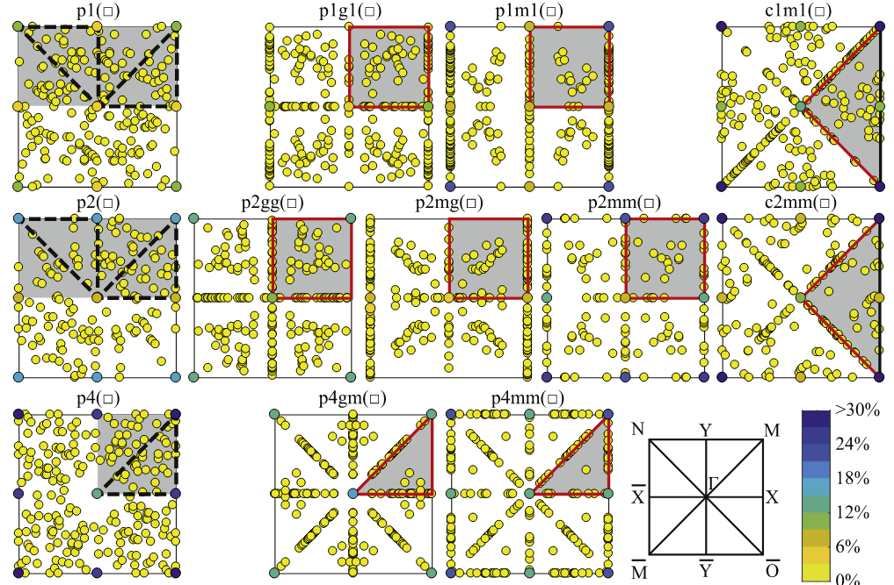
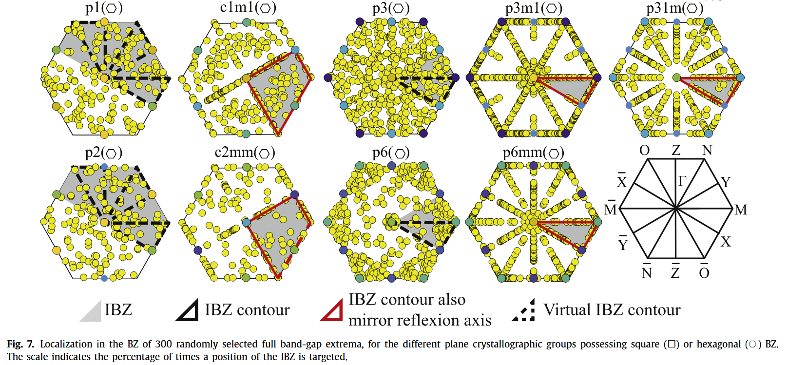
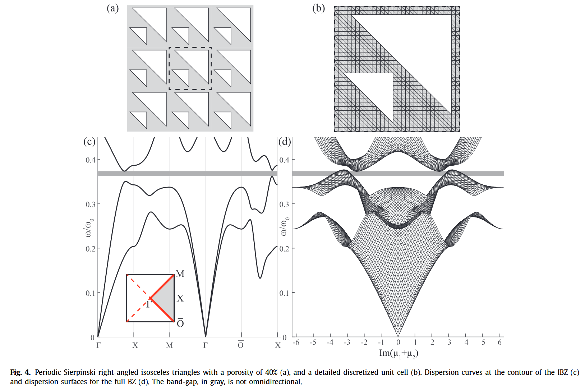

---

---

---
Note that for a fully unsymmetric UC, cf. Fig. 1a, the OABCO contour does not represent the full IBC. In this work, however, only the OABCO and OABCOB contours are considered during the optimization while **no symmetry is imposed in the UC** to minimize the computational effort. The entire first Brillouin zone is checked in post-processing to ensure a full omni-directional bandgap is achieved.

---
Imposing symmetry reduces the amount of design variables, respectively to one forth and one eight for both considered symmetries. Therefore it is generally more difficult to find resulting omni-directional bandgaps.

The symmetry is only imposed during the analysis of the zipper methodology, further on in this manuscript, no symmetry is imposed to allow the largest possible design freedom to the optimizer.

---

During topology optimization, the geometry of the unit cell of phononic crystals will be changed step by step but will keep the required symmetry.

Considering the possible influence of initial designs on final results, we start from random designs which satisfy the inherent symmetry and repeat the whole procedure several times with accidental similar results.

---

